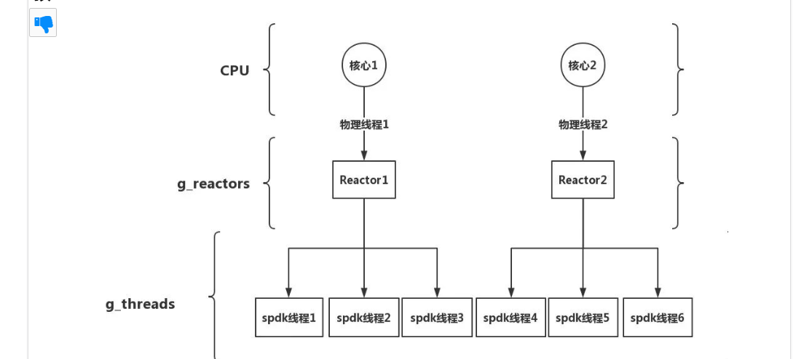

# 欢迎来到Tcore
Tcore是基于rust编写的可在qemu和真实硬件平台上运行的64位操作系统，在开发的过程中我们学习和解决了一系列问题现在将主要问题和解决办法分列如下。在此之前特别致谢吴一凡提供的精美rcore-tutorial-v3以及他本人在开发过程中的答疑和从哈工深Ultraos中得到的支持。

## 比赛准备和调研
首先是我们期待达到的目标，即可以展示SPDK的线程模型的教学操作系统。Tcore的设计是我们在不确定中寻找确定性的一次尝试，在os的比赛过程中我们循迹了无数前人的探索，得到的成果可谓是大有裨益，此也为后人学习和交流留下的宝贵资源。我们的探索是艰难且富有意义的，对于我们这样缺少os实训平台的学校，我们希望尽自己的一部分努力将我们学习 OS 过程中的一些新的探究成果及学习成效分享给同学们。在学习的过程中我们深感 OS 复杂且精妙的结构，每一次对于新知识的获取和领悟都使得我们为之兴奋。对此次比赛，我们将前期准备分列如下。
+ 前期对于os概念的学习

    我们在开发中整理了rcore-tutorial-book-v3相关的概念形成了约八万字的文档同时进行了一些流程图和概念图的梳理便于我们开发查阅以及为后续继续完善和学习的同学留下快速上手的资料。文档地址如下：https://shimo.im/docs/KlkKVy55PBTwreqd
+ SPDK线程模型的引进

    在目前分布式云存储发展火热的情况下，工业上对于SPDK的运用也更加的普遍，对此我们也希望在开发的过程中能够吸收其中的一些核心思想来在教学实践中让同学们能够在快速上手 OS 的同时也能了解目前计算机工业领域的一些成熟技术栈。对此我们进行了许多尝试包括直接引进SPDK的rust绑定仓库地址如下：https://github.com/openebs/spdk-sys.git
他会将spdk仓库也直接同步过来，但是我们发现他过于庞大，于是我们聚焦在多核的线程模型的抽象与实现，以此来达成SPDK设计的核心——————无锁化编程。由于我们的初赛的时间有限目前仅仅完成了线程抽象，SPDK模型还在改进中。
文档地址：https://www.daimajiaoliu.com/daima/8c76677d954e802
+ 多核的基础与改进

    由于SPDK线程模型的需要我们需要在多核基础上实现于是我们在去年哈工深Ultraos上进行学习和大量改动在此之前学习了解他的文档和主要的设计思路以便于我们快速上手和学习。这里特别感谢李程浩团队的作品和他本人对于前期开发给与的帮助。再次感谢。
  
## 系统设计和模块设计
+ 地址空间mm模块及memory_set相关函数的改写
+ 线程改进与task模块的重写
+ trap模块的重写
+ 其他包括为通过初赛样例的makefile调整和便于使用的user_shell的调整
+ config模块参数的重写设计
+ 整体的模块设计如图所示


## 开发计划
+ 初赛阶段对于通过测试样例改进了许多东西也成功完成了线程抽象
+ 复赛期间完成SPDK模型改进以及编写更加便于学习理解的文档教程

  
## 遇到的主要问题和解决办法
+ 由于线程共享地址空间于是将原来的配置文件和地址空间布局进行了改写目前地址空间布局如下：


+ trap相关处理重写了trap模块使得内核栈和用户栈平滑过渡。相关代码如下：
```asm
.altmacro
.macro SAVE_GP n
    sd x\n, \n*8(sp)
.endm
.macro LOAD_GP n
    ld x\n, \n*8(sp)
.endm
    .section .text.trampoline
    .globl __alltraps
    .globl __restore
    .align 2
__alltraps:
    csrrw sp, sscratch, sp
    # now sp->*TrapContext in user space, sscratch->user stack
    # save other general purpose registers
    sd x1, 1*8(sp)
    # skip sp(x2), we will save it later
    sd x3, 3*8(sp)
    # skip tp(x4), application does not use it
    # save x5~x31
    .set n, 5
    .rept 27
        SAVE_GP %n
        .set n, n+1
    .endr
    # we can use t0/t1/t2 freely, because they have been saved in TrapContext
    csrr t0, sstatus
    csrr t1, sepc
    sd t0, 32*8(sp)
    sd t1, 33*8(sp)
    # read user stack from sscratch and save it in TrapContext
    csrr t2, sscratch
    sd t2, 2*8(sp)
    # load kernel_satp into t0
    ld t0, 34*8(sp)
    # load trap_handler into t1
    ld t1, 36*8(sp)
    # move to kernel_sp
    ld sp, 35*8(sp)
    # switch to kernel space
    csrw satp, t0
    sfence.vma
    # jump to trap_handler
    jr t1

__restore:
    # a0: *TrapContext in user space(Constant); a1: user space token
    # switch to user space
    csrw satp, a1
    sfence.vma
    csrw sscratch, a0
    mv sp, a0
    # now sp points to TrapContext in user space, start restoring based on it
    # restore sstatus/sepc
    ld t0, 32*8(sp)
    ld t1, 33*8(sp)
    csrw sstatus, t0
    csrw sepc, t1
    # restore general purpose registers except x0/sp/tp
    ld x1, 1*8(sp)
    ld x3, 3*8(sp)
    .set n, 5
    .rept 27
        LOAD_GP %n
        .set n, n+1
    .endr
    # back to user stack
    ld sp, 2*8(sp)
    sret


```

汇编逻辑如下：


+ 初始进程的添加以及新的进程调用调用的问题，将PCB包裹在Arc<Mutex<>>模块更安全的用于多核线程初始化代码如下
```rust
pub struct ProcessControlBlock {
    //immutable
    pub pid: PidHandle,
    //mutable
    inner:  Arc<Mutex<ProcessControlBlockInner>>,
}
```
为了便于清晰理解这个过程我们绘制了以下的流程图：


+ Tcore开机流程示意


## 作品特征描述
Tcore目前是能够稳定在双核qemu虚拟机或者k210板上运行，同时在processor文件处理好的情况下更换新的sbi后理论上可以在4核平台上运行。复赛阶段若有余力的话我们会进行拓展，同时也交流学习到了一些多核故障的处理。同时我们继承了前辈优秀的FAT32文件系统。目前Tcore文档的支持是相当丰富的我们同时也在仓库中放置了一些整理的文档，结合上文在前期调研的一些文档我们希望能够同学们快速上手，享受到目前国内大学生对于操作系统探索的一些成果！同时在此模块中我们将大赛开发中几个好用的工具也一便放置于此。
+ 绘制白板：https://ajietextd.github.io/
+ 流程图绘制 ：推荐ProcessOn
+ GDB调试面板DashBoard：https://github.com/cyrus-and/gdb-dashboard  网速不好的情况下可以直击复制在自己工作目录下使用(保持文件名相同复制.gdbinit文件内容)
+ GDB常见命令：https://mp.weixin.qq.com/s/XxPIfrQ3E0GR88UsmQNggg
  
## 分工和协作
+ 王炼(队长)：负责task模块的重写和trap的设计
+ 王涛(队员)： 负责样例测试以及task模块的设计
+ 陈钰霖(队员 )： 负责文档整理以及shell设计和解决task一些bug

## 仓库文件阅读提示
+ codes/os：放置内核代码
+ codes/dependency:为稳定支持inline_asm指定的本地库以及其他依赖经过我们的研究测试可以支持llvm_asm!和asm!
+ codes/fat32 ：构建文件系统
+ codes/user：用户程序
+ docs ：相关文档以及相关插图

## 比赛收获
本次大赛我们是从去年开始学习rust语言和操作系统相关知识，在本次大赛报名之后我们确立了开发的方向和要创新的地方。我们所处的地区因为疫情也使得开发过程出现了一些困难。但是在整个过程中我们前后迭代代码逾四千多行在开发中不断学习也写下了许多文档，最为重要的收获是在这个过程中许多同学的无私帮忙也在不断的解决报错中深入理解了OS的概念坚定了我们复赛的信念。同时我们也希望将这样的精神和知识传递下去争取在我们学校的教学过程中也引入相关的OS实训平台。
